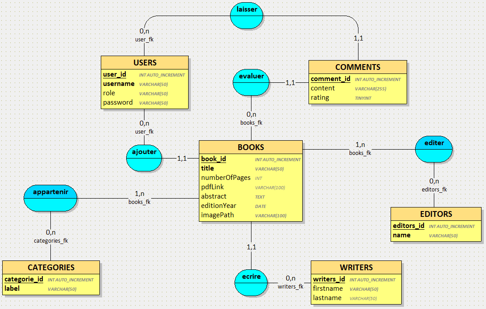
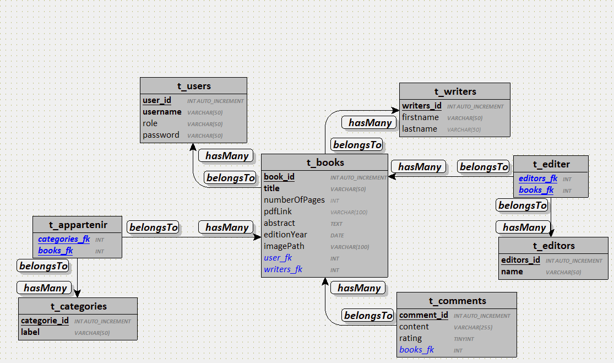

# P_Web 295 - Passion Lecture ( Backend )

Auteurs : Jonathan Junod et Néo Darbellay
Chef de projet : Grégory Charmier (GCR)
Dates : 28.04.2026 - 26.05.2026
Module : C295

## Introduction

> Dans ce rapport, nous parlerons de la manière par laquelle l'équipe a organisé et divisé les tâches ainsi que l'outil que nous avons utilisé afin de se faire. Nous aborderons une partie analyse de l'application et nous parlerons de l'architecture de la base de données. Nous présenterons un tableau des routes mises en place ainsi que leurs fonction. Enfin nous détaillerons l'organisation du code et de l'équipe par rapport à la réalisation des tâches. Nous conclurons évidemment par une conclusion générale ainsi qu'un cours paragraphe par personne sur une brève conclusion personnelle.
>
> Ce projet a pour objectif de concevoir et développer une application web complète permettant la gestion de livres en leur attachants des commentaires, des catégories, des éditeurs ainsi qu'au moins un écrivain. Cette application repose sur une architecture MVC séparant le frontend et le backend. Dans cette partie du projet, nous allons donc développer une API REST, une base de donnée de type SQL ainsi qu'un système d’authentification des utilisateurs.
>
> Ce morceau de projet consiste donc en améliorer et compléter un frontend réalisé précédemment en Vue.js au cours du module 294, puis à développer une API REST complète avec AdonisJS, MySQL ainsi qu'une multitudes d'autres outils.
>
> L’application développée permettra aux utilisateurs de consulter les ouvrages disponibles ainsi que leurs catégories. Les utilisateurs connectés peuvent ajouter, modifier ou supprimer leurs propres livres. Ils peuvent aussi ajouter des commentaires accompagnés d'une note de 0 à 5 sur les livres.

CONTEXTE : Explication briève du projet
PAGES : 1

## Analyse

### Planification des tâches

> Afin de travailler efficacement, nous avons décidé d'utiliser un outil de gestion de projet très répandu dans le monde de la programmation. En effet, afin de rester organisé, nous avons utilisé GitHub Project.  
> Cet outil nous permet de notamment
>
> - Créer des tâches.
> - Définir qui est responsable de quelle tâche.
> - Déplacer des tâches dans des catégories en fonction de leur état.
> - Et bien d'autres choses dont nous n'avons pas eu besoin jusqu'à présent.
>
> En effet, à l'aide de GitHub Project, nous avons pu créer des tâches concernant le projet. Nous avons essayé de maintenir une granularité d'environ 45 minutes à 1 heure pour ces tâches, c'est à dire que n'importe laquelle de ces tâches devrait pourvoir être réalisée en ces délais. Nous aurions pu décider de créer des tâches plus précises afin d'être ensuite plus efficace (une personne par demi-tâche afin d'expédier ce qui est bloquant tout de suite), mais nous avons décidé qu'une période par tâche serait un bon compromis. Ceci car le temps à disposition afin de réaliser le projet est très limité et nous ne souhaitions pas perdre trop de temps là dessus.
>
> Nous avons aussi parlé de l'assignation des tâches par GitHub. Cet outil merveilleux, nous permet en effet d'assigner et de s'assigner à plusieurs tâches. Les concernés sont alors notifié par mail (sauf si cela à été explicitement désactivé par le/la concerné(e)) et peuvent consulter la tâche à réaliser.
>
> Enfin GitHub Project nous permet aussi de déplacer des tâches en fonction de leur avancée dans diverses colonnes. GitHub nous mets directement plusieurs colonnes à disposition que voici.
>
> 1. **Backlog** : cette colonne indique que la tâche figure dans le backlog et devra être réalisée. Pour le moment, les circonstances ne permettent pas de réaliser la tâche. Par exemple, nous ne pouvons pas commencer à réaliser les _modèles_ et _migrations_ Adonis tant que les documents MCD et MLD n'ont pas été fournis.
> 2. **Ready** : Dans cette catégorie, les tâches sont prêtes à être prises afin d'être réalisées, tout ce qu'il manque est un (ou plusieurs) participant assigné (et optionnellement motivé).
> 3. **In progress** : ces issues sont en train d'être réalisé, tout n'est plus qu'une question de temps à ce moment. Un ou plusieurs développeur travaille activement dessus.
> 4. **In review** : Ici, les activités sont en train d'être testées puis validées, une tâche laissée de côté peut se retrouver ici.
> 5. **Done** : Enfin, ma colonne préférée, Done signifie que la présente tâche est terminée et validée, il n'y a donc plus aucun travail à fournir pour ce point.

CONTEXTE : Parler de quel outil de planification (donner un lien aussi, probablement) a été utilisé pendant le projet
PAGES : ?

### Analyse de l'API REST

#### Catégories

| Verbe HTTP | URI                 | JSON             | Auth |
| :--------- | :------------------ | :--------------- | :--- |
| GET        | /api/categories     | -                | Non  |
| GET        | /api/categories/:id | -                | Non  |
| POST       | /api/categories     | {"label":"Dogs"} | Oui  |
| PUT        | /api/categories/:id | {"label":"Cats"} | Oui  |
| DELETE     | /api/categories/:id | -                | Oui  |

#### Éditeurs

| Verbe HTTP | URI              | JSON           | Auth |
| :--------- | :--------------- | :------------- | :--- |
| GET        | /api/editors     | -              | Non  |
| GET        | /api/editors/:id | -              | Non  |
| POST       | /api/editors     | {"name":"Noé"} | Oui  |
| PUT        | /api/editors/:id | {"name":"Néo"} | Oui  |
| DELETE     | /api/editors/:id | -              | Oui  |

#### Livres

| Verbe HTTP | URI            | JSON                                                                                                                                                                                                                                     | Auth |
| :--------- | :------------- | :--------------------------------------------------------------------------------------------------------------------------------------------------------------------------------------------------------------------------------------- | :--- |
| GET        | /api/books     | -                                                                                                                                                                                                                                        | Non  |
| GET        | /api/books/:id | -                                                                                                                                                                                                                                        | Non  |
| POST       | /api/books     | {"title":"Something strange happened","numberOfPages":319,"pdfLink":"/false","abstract":"Just an easter egg for Noe to find","editionYear":"2025","imagePath":"./true","userId":1,"writerId":2,"editorsIds":[3,4],"categoriesIds":[1,2]} | Oui  |
| PUT        | /api/books/:id | {"title":"Something strange happened","numberOfPages":319,"pdfLink":"/false","abstract":"Just an easter egg for Noe to find","editionYear":"2025","imagePath":"./true","userId":1,"writerId":2,"editorsIds":[3,4],"categoriesIds":[1,2]} | Oui  |
| DELETE     | /api/books/:id | -                                                                                                                                                                                                                                        | Oui  |

#### Users

| Verbe HTTP | URI                 | JSON | Auth |
| :--------- | :------------------ | :--- | :--- |
| POST       | /api/users/register | -    | Non  |
| POST       | /api/users/login    | -    | Non  |
| POST       | /api/users/logout   | -    | Oui  |
| GET        | /api/users          | -    | Oui  |
| GET        | /api/users/:id      | -    | Oui  |
| PUT        | /api/users/:id      | -    | Oui  |
| DELETE     | /api/users/:id      | -    | Oui  |
| GET        | /api/me             | -    | Oui  |

#### Docs

| Verbe HTTP | URI      | JSON | Auth |
| :--------- | :------- | :--- | :--- |
| GET        | /swagger | -    | Non  |
| GET        | /docs    | -    | Non  |

PAGES : 1

### Analyse de la DB

> À présent, nous allons parler de la base de données et plus précisément de sa conception.
>
> Concernant la base de données, nous avons essayé de faire au plus simple, sans sacrifier les performances de l'application.
>
> La table `t_book` se coeur du schéma est . C’est là que l'on stocke tout le contenu des livre, c'est à dire
>
> - le titre
> - le résumé
> - le nombre de pages
> - l'année
> - les liens pour la couverture et le PDF.
>
> Afin de savoir qui a ajouté le livre sur le site, nous avons mis une simple relation belongsTo qui relie le livre à l'utilisateur. Nous avons aussi ajouté une table `t_writer` avec le même type de relation afin de lier un livre avec un écrivain.  
> Plus compliqué ensuite, les relations entre books et leurs éditeurs ainsi que leurs catégories. Puisqu'un livre peut avoir plusieurs éditeurs et catégories, nous avons mis en place 2 tables (`t_appartenir` et `t_editer`). Ainsi lorsqu'un livre est créé, nous devons créer autant d'enregistrement dans les tables `belong` et `edit` qu'il y a d'éditeurs et de catégories attachées à ce livre.

CONTEXTE : MCD, MLD, MPD (Migrations, optionnel dans notre contexte)
PAGES : 1

#### Relations des modèles

> Nous allons détailler une peu plus ces relations entre les table de la base de données. En effet, il faut tout d'abords savoir qu'Adonis propose quelque relations prédéfinies telles que les 2 que nous avons utilisé. Nous parlons ici des relations `BelongsTo` et `HasMany`, ces dernières sont complémentaires et conviennent parfaitement à notre architecture db.  
> Concernant la partie _simple_ des relations, nous avons mis en place la relation `HasMany` -> `BelongsTo` depuis Books vers Comments, Écrivains vers Books, Users vers Books et enfin Users vers Comments. Par exemple, une utilisateur peut créer plusieurs commentaires.
>
> Maintenant vient la partie plus complexe qui nous a posé problème durant la mise en place du CRUD des livres. Les relations entre Books - Catégories et Books - Éditeurs sont de type 1, n - 0, n. En effet, un livre doit appartenir à au moins une catégorie ainsi qu'un éditeur. Cependant ce même livre peut appartenir à plusieurs catégories et éditeurs. Et étant donné qu'une catégorie peut posséder entre 0 et n livre de même qu'un éditeur peut éditer entre 0 et n livres, nous aurions eu un problème de foreign key si nous nous étions contenté de 2 tables (et MySQL n'aurait de toutes manières pas accepté cet affront).  
> C'est pourquoi nous avons mis en place un table intermédiaire qui possèdera les 2 fks. La relation se fait donc ainsi : Books Hasmany enregistrements dans la table intermédiaire et cette même table Belongsto un seul livre et en même temps un seul éditeur/catégorie. Évidemment un éditeur/catégorie Hasmany enregistrements dans la table intermédiaire.

CONTEXTE : Parler des hasMany, hasOne, belongsTo, foreign key, etc. en complétant dans le MCD
PAGES : ?

### Schéma d'interaction frontend/backend

CONTEXTE : Faire un schéma des composants (API REST, DB, ORM, etc.) visuellement et leurs liens
PAGES : ?

## Réalisation

### Authentification et rôles

CONTEXTE : Parler de la gestion de l'auth et rôles
PAGES : 1

### Mesures de sécurité

CONTEXTE : Parler des mesures prises pour la sécurité de notre application
PAGES : 1

## Test

CONTEXTE : Parler des tests réalisés pour voir si tout marchait bien (ex. Bruno)
PAGES : 1

## Conclusion

### Organisation du groupe de la gestion du code

CONTEXTE : Parler de comment on a fait avec GitHub
PAGES : 0.5

### Conclusion Générale

CONTEXTE : Parler de ce qu'on a fait / pas fait / comment ça c'est déroulé / soucis
PAGES : 0.5

### Conclusion Personelle

#### Jonathan

PAGES : 0.5

#### Néo

PAGES : 0.5

### Planification du projet

CONTEXTE : Critique constructive sur notre planification
PAGES : 0.5
